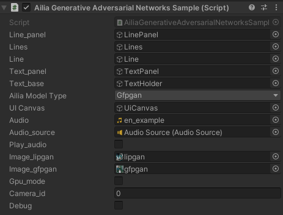
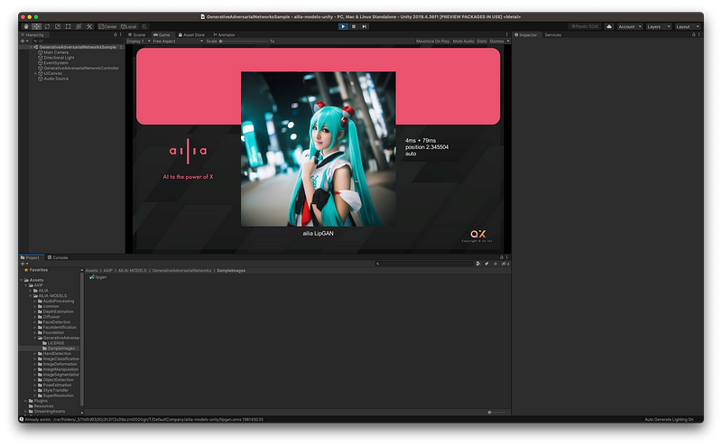
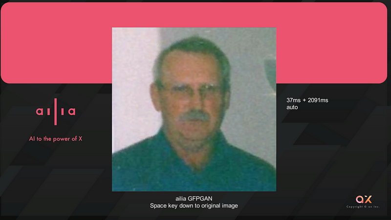
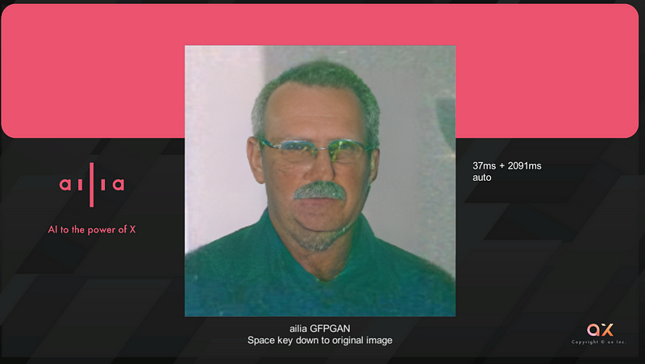

# Generative adversarial networks

## Tutorial

Please open the GenerativeAdversarialNetworksSample.unity in Unity. Select the GenerativeAdversarialNetworkController and choose the model you want to run with AIliaModelType.

Give the input image to either image_lipgan or image_gfpgan. If you set the input image to null, it will process the camera.

## LipGAN

LipGAN is a model that performs lip synchronization based on an input audio file and an image file. After applying BlazeFace to the input image, the model performs lip rewriting with a resolution of 96x96 on the face image. The input audio is frequency transformed using ailia.audio.

## GFPGAN

GFPGAN corrects face images in high quality. After applying BlazeFace to the input image, it performs correction on the face image with a resolution of 512x512.

