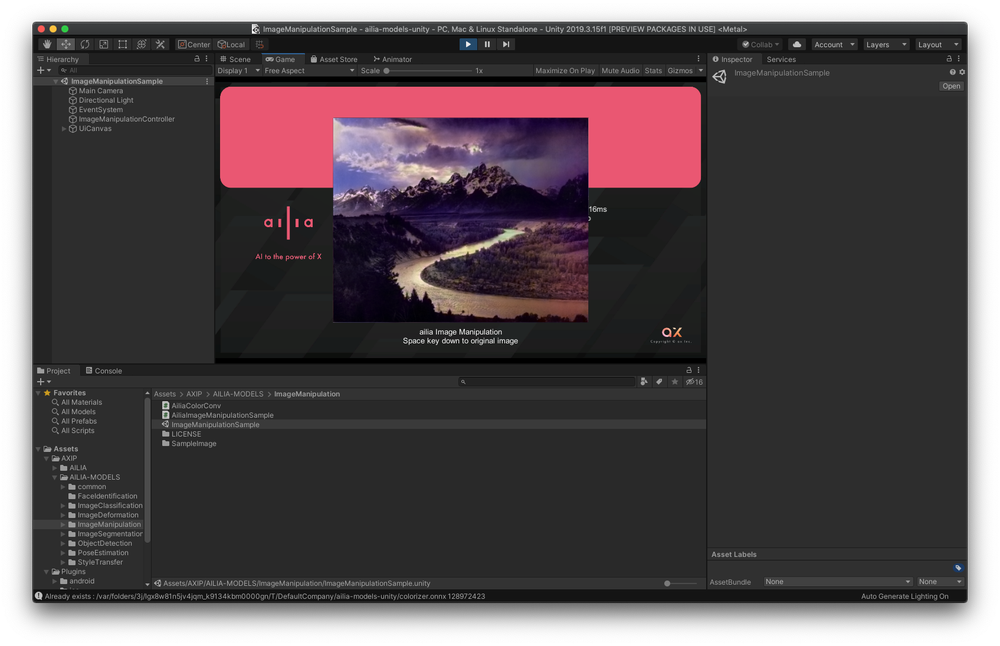

# ailia-models-unity

The collection of pre-trained, state-of-the-art models for Unity.

## Setup

This repository does not include ailia libraries. So you must get license and import ailia libraries to Plugin folder.

[Download ailia SDK trial version](https://ailia.jp/en/)

[ailia SDK Tutorial (Unity)](https://medium.com/axinc-ai/ailia-sdk-tutorial-unity-54f2a8155b8f)

## Supported platforms

- Unity 2019.3.15f1 and later
- Deployment to Windows, Mac, iOS, Android and Linux

# Supporting Models

We are now converting to C#. Please wait to complete conversion.

## Image classification

| Name | Detail | Exported From | Supported Ailia Version |
|:-----------|------------:|:------------:|:------------:|
| [googlenet](/Assets/AXIP/AILIA-MODELS/ImageClassification/) |[Going Deeper with Convolutions]( https://arxiv.org/abs/1409.4842 )|Pytorch| 1.2.0 and later|
| [resnet50](/Assets/AXIP/AILIA-MODELS/ImageClassification/) | [Deep Residual Learning for Image Recognition]( https://github.com/KaimingHe/deep-residual-networks) | Chainer | 1.2.0 and later |
| [inceptionv3](/Assets/AXIP/AILIA-MODELS/ImageClassification/)|[Rethinking the Inception Architecture for Computer Vision](http://arxiv.org/abs/1512.00567)|Pytorch| 1.2.0 and later |
| [mobilenetv2](/Assets/AXIP/AILIA-MODELS/ImageClassification/)|[PyTorch Implemention of MobileNet V2](https://github.com/d-li14/mobilenetv2.pytorch)|Pytorch| 1.2.0 and later |
| [mobilenetv3](/Assets/AXIP/AILIA-MODELS/ImageClassification/)|[PyTorch Implemention of MobileNet V3](https://github.com/d-li14/mobilenetv3.pytorch)|Pytorch| 1.2.1 and later |
| [partialconv](/Assets/AXIP/AILIA-MODELS/ImageClassification/)|[Partial Convolution Layer for Padding and Image Inpainting](https://github.com/NVIDIA/partialconv)|Pytorch| 1.2.0 and later |
| [resnet50](/Assets/AXIP/AILIA-MODELS/ImageClassification/) | [Deep Residual Learning for Image Recognition]( https://github.com/KaimingHe/deep-residual-networks) | Chainer | 1.2.0 and later |

## Image deformation

| Name | Detail | Exported From | Supported Ailia Version |
|:-----------|------------:|:------------:|:------------:|
| [dewarpnet](/Assets/AXIP/AILIA-MODELS/ImageDeformation/) | [DewarpNet: Single-Image Document Unwarping With Stacked 3D and 2D Regression Networks](https://github.com/cvlab-stonybrook/DewarpNet) | Pytorch | 1.2.1 and later |

## Image segmentation

| Name | Detail | Exported From | Supported Ailia Version |
|:-----------|------------:|:------------:|:------------:|
| [deeplabv3](/Assets/AXIP/AILIA-MODELS/ImageSegmentation/) | [Xception65 for backbone network of DeepLab v3+](https://github.com/tensorflow/models/tree/master/research/deeplab) | Chainer | 1.2.0 and later |
| [hrnet_segmentation](/Assets/AXIP/AILIA-MODELS/ImageSegmentation/) | [High-resolution networks (HRNets) for Semantic Segmentation](https://github.com/HRNet/HRNet-Semantic-Segmentation) | Pytorch | 1.2.1 and later |
| [hair_segmentation](/Assets/AXIP/AILIA-MODELS/ImageSegmentation/) | [hair segmentation in mobile device](https://github.com/thangtran480/hair-segmentation) | Keras | 1.2.1 and later |
| [pspnet-hair-segmentation](/Assets/AXIP/AILIA-MODELS/ImageSegmentation/) | [pytorch-hair-segmentation](https://github.com/YBIGTA/pytorch-hair-segmentation) | Pytorch | 1.2.2 and later |

## Image manipulation

| Name | Detail | Exported From | Supported Ailia Version |
|:-----------|------------:|:------------:|:------------:|
| [srresnet](/Assets/AXIP/AILIA-MODELS/ImageManipulation/) | [Photo-Realistic Single Image Super-Resolution Using a Generative Adversarial Network](https://github.com/twtygqyy/pytorch-SRResNet) | Pytorch | 1.2.0 and later |
| [noise2noise](/Assets/AXIP/AILIA-MODELS/ImageManipulation/) | [Learning Image Restoration without Clean Data](https://github.com/joeylitalien/noise2noise-pytorch) | Pytorch | 1.2.0 and later |
| [illnet](/Assets/AXIP/AILIA-MODELS/ImageManipulation/) | [Document Rectification and Illumination Correction using a Patch-based CNN](https://github.com/xiaoyu258/DocProj) | Pytorch | 1.2.2 and later |
| [colorization](/Assets/AXIP/AILIA-MODELS/ImageManipulation/) | [Colorful Image Colorization](https://github.com/richzhang/colorization) | Pytorch | 1.2.2 and later |

## Object detection

| Name | Detail | Exported From | Supported Ailia Version |
|:-----------|------------:|:------------:|:------------:|
| [yolov1-tiny](/Assets/AXIP/AILIA-MODELS/ObjectDetection/) | [YOLO: Real-Time Object Detection](https://pjreddie.com/darknet/yolov1/) | Darknet | 1.1.0 and later |
| [yolov1-face](/Assets/AXIP/AILIA-MODELS/ObjectDetection/) | [YOLO-Face-detection](https://github.com/dannyblueliu/YOLO-Face-detection/) | Darknet | 1.1.0 and later |
| [yolov2](/Assets/AXIP/AILIA-MODELS/ObjectDetection/) | [YOLO: Real-Time Object Detection](https://pjreddie.com/darknet/yolo/) | Pytorch | 1.2.0 and later |
| [yolov3](/Assets/AXIP/AILIA-MODELS/ObjectDetection/) | [YOLO: Real-Time Object Detection](https://pjreddie.com/darknet/yolo/) | ONNX Runtime | 1.2.1 and later |
| [yolov3-tiny](/Assets/AXIP/AILIA-MODELS/ObjectDetection/) | [YOLO: Real-Time Object Detection](https://pjreddie.com/darknet/yolo/) | ONNX Runtime | 1.2.1 and later |
| [yolov3-face](/Assets/AXIP/AILIA-MODELS/ObjectDetection/) | [Face detection using keras-yolov3](https://github.com/axinc-ai/yolov3-face) | Keras | 1.2.1 and later |
| [yolov3-hand](/Assets/AXIP/AILIA-MODELS/ObjectDetection/) | [Hand detection branch of Face detection using keras-yolov3](https://github.com/axinc-ai/yolov3-face/tree/hand_detection) | Keras | 1.2.1 and later |
| [yolov4](/Assets/AXIP/AILIA-MODELS/ObjectDetection/) | [YOLO: Real-Time Object Detection](https://pjreddie.com/darknet/yolo/) | Pytorch | 1.2.1 and later |
| [yolov4-tiny](/Assets/AXIP/AILIA-MODELS/ObjectDetection/) | [YOLO: Real-Time Object Detection](https://pjreddie.com/darknet/yolo/) | Pytorch | 1.2.1 and later |
| [mobilenet_ssd](/Assets/AXIP/AILIA-MODELS/ObjectDetection/) | [MobileNetV1, MobileNetV2, VGG based SSD/SSD-lite implementation in Pytorch](https://github.com/qfgaohao/pytorch-ssd) | Pytorch | 1.2.1 and later |

## Pose estimation

| Name | Detail | Exported From | Supported Ailia Version |
|:-----------|------------:|:------------:|:------------:|
| [lightweight-human-pose-estimation](/Assets/AXIP/AILIA-MODELS/PoseEstimation/) | [Fast and accurate human pose estimation in PyTorch. Contains implementation of "Real-time 2D Multi-Person Pose Estimation on CPU: Lightweight OpenPose" paper.](https://github.com/Daniil-Osokin/lightweight-human-pose-estimation.pytorch) | Pytorch | 1.2.1 and later |

## Style transfer

| Name | Detail | Exported From | Supported Ailia Version |
|:-----------|------------:|:------------:|:------------:|
| [adain](/Assets/AXIP/AILIA-MODELS/StyleTransfer/) | [Arbitrary Style Transfer in Real-time with Adaptive Instance Normalization](https://github.com/naoto0804/pytorch-AdaIN)| Pytorch | 1.2.1 and later |

## Face identification

| Name | Detail | Exported From | Supported Ailia Version |
|:-----------|------------:|:------------:|:------------:|
|[vggface2](/Assets/AXIP/AILIA-MODELS/FaceIdentification/) | [VGGFace2 Dataset for Face Recognition](https://github.com/ox-vgg/vgg_face2) | Caffe | 1.1.0 and later |

# Other languages

[python version](https://github.com/axinc-ai/ailia-models)

[c++ version](https://github.com/axinc-ai/ailia-models-cpp)
