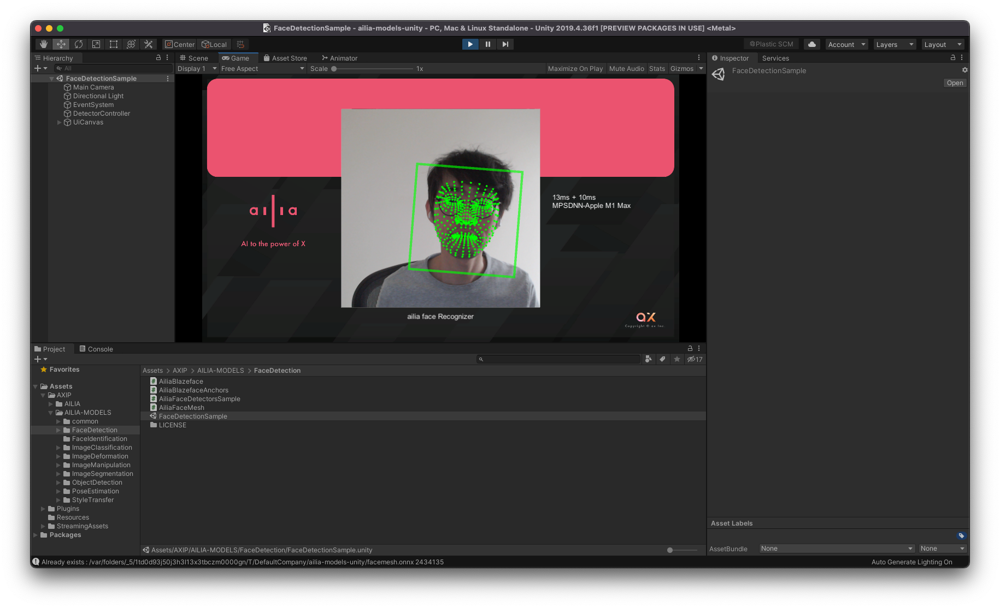

# ailia MODELS Unity tutorial

## Requirements

- Unity 2021.3.10f1 and later

## Supported platforms

- Deployment to Windows, Mac, iOS, Android and Linux

## Setup

Clone this repository and open the project in unity.

```
git clone git@github.com:ailia-ai/ailia-models-unity.git
```

This repository automatically download ailia SDK from Unity Package manager.

## Run

You can run it by opening the sample scene (AXIP/AILIA-MODELS/FaceDetection/FaceDetectionSample.unity) and pressing Run.


