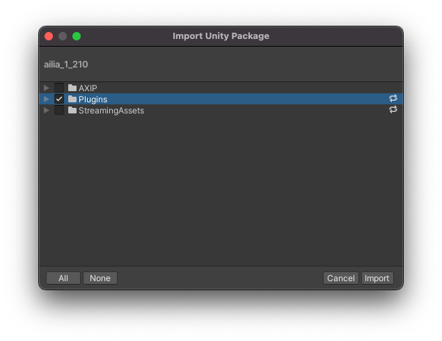

# ailia MODELS Unity tutorial

## Requirements

- Unity 2019.3.15f1 and later

## Supported platforms

- Deployment to Windows, Mac, iOS, Android and Linux

## Setup

Clone this repository and open the project in unity.

```
git clone git@github.com:axinc-ai/ailia-models-unity.git
```

This repository does not include ailia libraries. So you must get SDK and license.

[Download ailia SDK trial version](https://ailia.jp/en/)

Open the unity package included in the SDK and import only the plugin.



## Run

You can run it by opening the sample scene (AXIP/AILIA-MODELS/FaceDetection/FaceDetectionSample.unity) and pressing Run.


